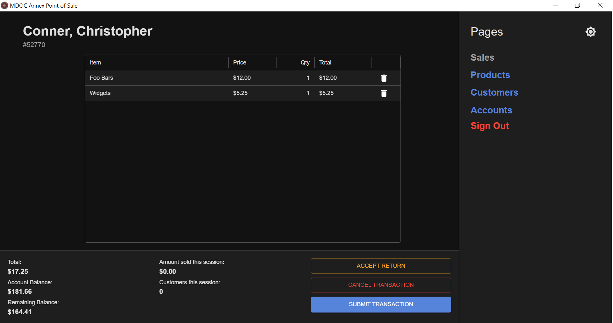

# Prepaid Point-of-Sale

A robust point-of-sale system built with **Tauri** and a **React** frontend, designed to run on Windows machines. It features frontend and backend validation, along with unit and integration tests to ensure stability during real-world use.

---

### 📌 Use Case

This system is designed specifically for **Maine State Prison**, where it enables inmates to order items using funds transferred to an annex account. Funds are:

- Sent via reports by the accounting office
- Parsed into the system
- Made available for purchases once processed

---

### 🛠️ Technical Overview

- **Architecture**: Follows the [Clean Architecture](https://blog.cleancoder.com/uncle-bob/2012/08/13/the-clean-architecture.html) model for modular, decoupled design that simplifies testing and future changes.
- **Database**:
  - Persistent storage: [`rusqlite`](https://github.com/rusqlite/rusqlite) (SQLite)
  - Legacy migration: via **ODBC** connection to Microsoft Access
- **PDF Generation**: Uses [`lopdf`](https://github.com/J-F-Liu/lopdf) to produce printable receipts
- **Platform**: Built for offline-first use on Windows machines

---

### ✅ Key Features

- Fully offline-capable desktop app
- Receipt printing and financial reporting
- Cleanly separated domains (UI, logic, persistence, integration)
- Built with testability and long-term maintainability in mind
